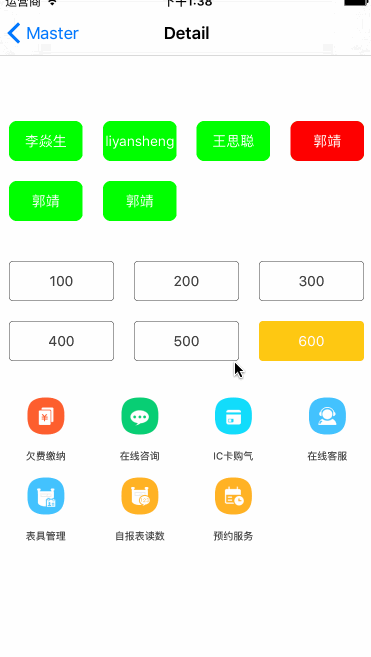

# LYSTagView
标签视图

##亮点
    可以通过初始化不通过的UICollectionViewCell来实现不同的标签内容显示

##效果图

## 属性
###pragma mark - cell显示的内容
@property(nonatomic,copy)NSMutableArray *items;

###pragma mark - UICollectionViewCell子类型对应的Class对象 使用时 如果需要在标签中显示不同的内容可以自定义自己的UICollectionViewCell
@property(nonatomic,strong)Class cellClass;

###pragma mark - 每个标签的高度
@property(nonatomic,assign)CGFloat itemH;

###pragma mark - 每行显示的列数
@property(nonatomic,assign)NSUInteger column;

###pragma mark - 代理方法
@property(nonatomic,weak)id<LYSTagViewDelegate> delegate;

##代理协议
@protocol LYSTagViewDelegate <NSObject>

###pragma mark - 在实例化cell时回调
-(void)tagView:(LYSTagView*)tagView procellCell:(UICollectionViewCell*)cell withItem:(NSDictionary*)item;

###pragma mark - 选中标签时回调
-(void)tagView:(LYSTagView*)tagView itemSelectedAtIndex:(NSUInteger)index withItem:(NSDictionary*)item;

@end

例子：

  tagView = [[LYSTagView alloc]initWithFrame:CGRectMake(0, 120, CGRectGetWidth(self.view.frame), 20)];
    NSMutableArray *data = [NSMutableArray array];
    [data addObject:[NSMutableDictionary dictionaryWithDictionary:@{@"name":@"李焱生"}]];
    [data addObject:[NSMutableDictionary dictionaryWithDictionary:@{@"name":@"liyansheng"}]];
    [data addObject:[NSMutableDictionary dictionaryWithDictionary:@{@"name":@"王思聪"}]];
    [data addObject:[NSMutableDictionary dictionaryWithDictionary:@{@"name":@"郭靖"}]];
    [data addObject:[NSMutableDictionary dictionaryWithDictionary:@{@"name":@"郭靖"}]];
    [data addObject:[NSMutableDictionary dictionaryWithDictionary:@{@"name":@"郭靖"}]];
    tagView.items = data;
    tagView.column = 4;
    tagView.itemH = 60.f;
    tagView.cellClass = [MyTagCell class];
    tagView.delegate = self;
    [self.view addSubview:tagView];
    
    
    //
    sumTagView = [[LYSTagView alloc]initWithFrame:CGRectMake(0, CGRectGetMaxY(tagView.frame) + 20, CGRectGetWidth(self.view.frame), 20)];
    NSMutableArray *data1 = [NSMutableArray array];
    [data1 addObject:[NSMutableDictionary dictionaryWithDictionary:@{@"sumValue":@"100"}]];
    [data1 addObject:[NSMutableDictionary dictionaryWithDictionary:@{@"sumValue":@"200"}]];
    [data1 addObject:[NSMutableDictionary dictionaryWithDictionary:@{@"sumValue":@"300"}]];
    [data1 addObject:[NSMutableDictionary dictionaryWithDictionary:@{@"sumValue":@"400"}]];
    [data1 addObject:[NSMutableDictionary dictionaryWithDictionary:@{@"sumValue":@"500"}]];
    [data1 addObject:[NSMutableDictionary dictionaryWithDictionary:@{@"sumValue":@"600"}]];
    sumTagView.items = data1;
    sumTagView.column = 3;
    sumTagView.itemH = 60.f;
    sumTagView.cellClass = [ChargeSumTagCell class];
    sumTagView.delegate = self;
    [self.view addSubview:sumTagView];
    
    
    menuTagView = [[LYSTagView alloc]initWithFrame:CGRectMake(0, CGRectGetMaxY(sumTagView.frame) + 20, CGRectGetWidth(self.view.frame), 20)];
    NSMutableArray *data2 = [NSMutableArray array];
    [data2 addObject:[NSMutableDictionary dictionaryWithDictionary:@{@"imageUrl":@"menu_bill_charge",@"placeHolderImage":@"",@"title":@"欠费缴纳"}]];
    [data2 addObject:[NSMutableDictionary dictionaryWithDictionary:@{@"imageUrl":@"menu_consult",@"placeHolderImage":@"",@"title":@"在线咨询"}]];
    [data2 addObject:[NSMutableDictionary dictionaryWithDictionary:@{@"imageUrl":@"menu_iccard_charge",@"placeHolderImage":@"",@"title":@"IC卡购气"}]];
    [data2 addObject:[NSMutableDictionary dictionaryWithDictionary:@{@"imageUrl":@"menu_online_service",@"placeHolderImage":@"",@"title":@"在线客服"}]];
    [data2 addObject:[NSMutableDictionary dictionaryWithDictionary:@{@"imageUrl":@"menu_table_manage",@"placeHolderImage":@"",@"title":@"表具管理"}]];
    [data2 addObject:[NSMutableDictionary dictionaryWithDictionary:@{@"imageUrl":@"menu_upload_meter",@"placeHolderImage":@"",@"title":@"自报表读数"}]];
    [data2 addObject:[NSMutableDictionary dictionaryWithDictionary:@{@"imageUrl":@"menu_work_service",@"placeHolderImage":@"",@"title":@"预约服务"}]];
    menuTagView.items = data2;
    menuTagView.column = 4;
    menuTagView.itemH = 80.f;
    menuTagView.cellClass = [MenuTagCell class];
    menuTagView.delegate = self;
    [self.view addSubview:menuTagView];
  
